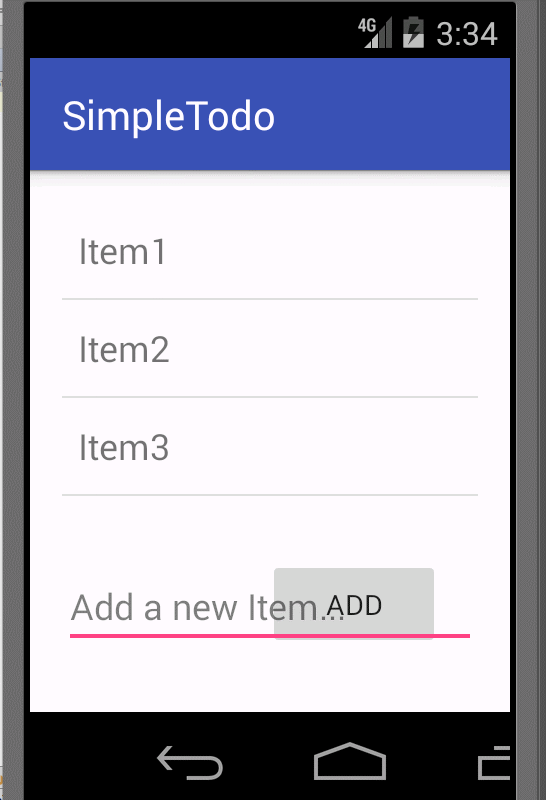

# Pre-work - *Simple Todo*

** Simple Todo** is an android app that allows building a todo list and basic todo items management functionality including adding new items, editing and deleting an existing item.

Time spent: **10** hours spent in total

## User Stories

The following **required** functionality is completed:

* [ ] User can **successfully add and remove items** from the todo list

## Video Walkthrough 

Here's a walkthrough of implemented user stories:

GIF created with [GifCam] 

