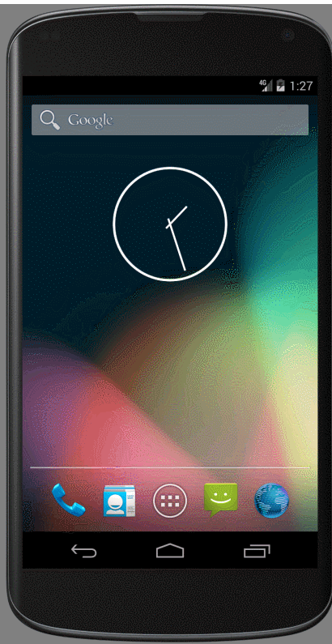
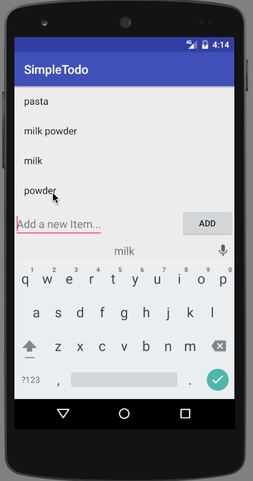
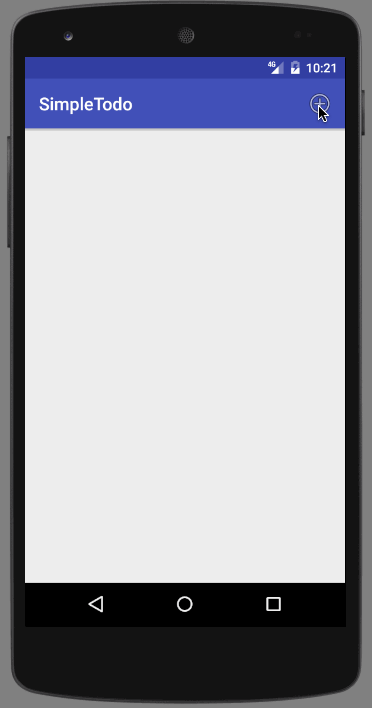

# TODOAPP

Android PreWork

This app that allows building a todo list and basic todo items management functionality including adding new items, editing and deleting an existing item.

Time spent: **10** hours spent in total

## User Stories

The following **required** functionality is completed:

* [ ] User can **successfully add and remove items** from the todo list
* [ ] User can **successfully edit items** from the todo list
* [ ] Persist the todo items into SQLite instead of a text file using SQLiteOpenHelper
* [ ] Improve style of the todo items in the list using a custom adapter

## Extensions 

* [ ] Added a DialogFragment instead of new Activity for editing items
* [ ] Added menu item to the app

## Video Walkthrough 

Here's a walkthrough of implemented user stories:
GIF created with [GifCam]!

## Dialog Fragment

## Notes

 Switch between screens, editing and passing value and position to next screen is bit confusing.
